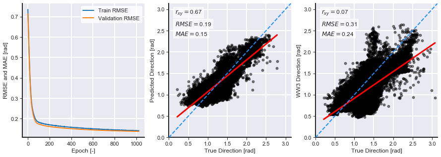
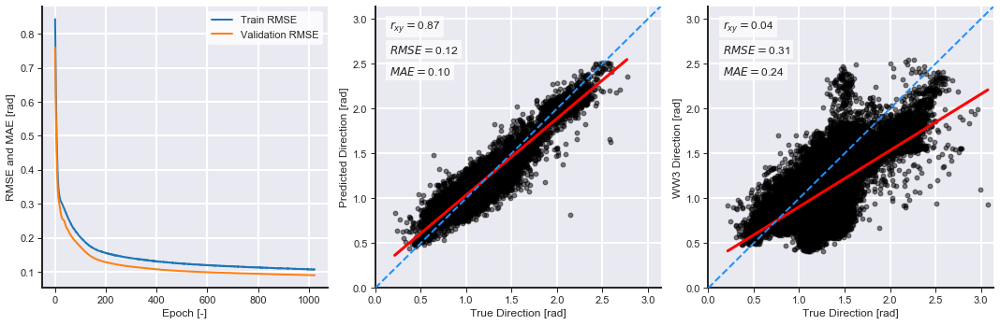
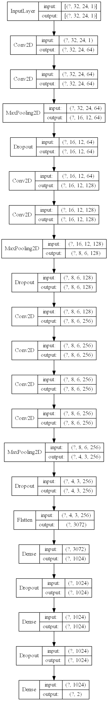
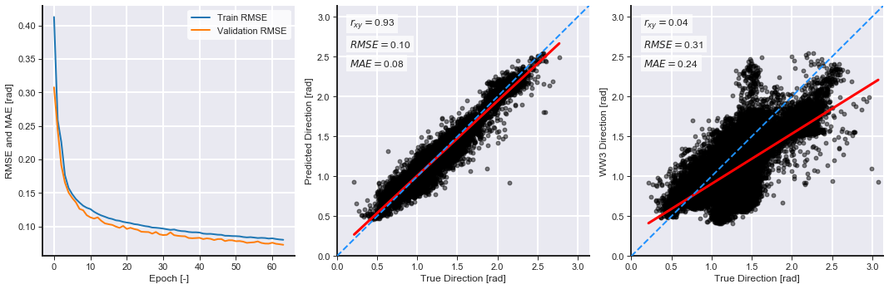

# Improving WW3 Results with Machine Learning

This repository contains the models used in the paper: Improving WaveWatchIII Outputs with Machine Learning current under review in Coastal Engineering.

There are 3 main notebooks in this repository:

## Downloading data

The spectral data is to heavy to be hosted by Github. Please use the links below to download the data:

1. Integrated parameters: https://drive.google.com/open?id=1CI0h-tqoHJbTnkj0H_oMZkGQHyur7ase

2. Spectral data: https://drive.google.com/open?id=1OD43Jyc5Uf8fXbAXYMr0DyPnZSTr0OA6

## 1. MLP with Integrated Parameters

This models uses integrated parameters (e.g., Hs, Tp, Dp, Winds) to correct poorly predicted wave directions by WW3.

The model is a multilayer perceptron (MLP) with 2 hidden layers and 512 hidden units per layer.

This model achieves a r-score of 0.67 after 1024 epochs on test data.

## 2. MLP with Spectral Data

This model uses the flattened wave spectra to correct poorly predicted wave directions by WW3.

The model is a multilayer perceptron with 2 hidden layers and 64 hidden units per layer.

This model achieves a r-score of 0.87 after 1024 epochs on test data.

Colab notebook:

## 3. CNN with Spectral Data

This models uses the wave spectrum (in its 2d form) to correct poorly predicted wave directions by WW3.

The model is a convolutional neural network (CNN) build based upon the VGG network. There are 3 VVG8 blocks with increasing number of convolutional filters and two fully connected layers.

This model achieves a r-score of 0.87 after 64 epochs on test data.

Note: this model is too heavy to run on CPU.

Colab notebook: https://drive.google.com/open?id=1YGCJLvlo8wdi_mY8ietL4ENPydSuGMd-

All tests split the data into 70  training and 30 testing. All models have a dropout rate of 0.25 after each hidden layer to help with overfitting.

## 4. Results:

### 4.1 Predictions on known timeseries data

### 4.2 Predictions on unknown timeseries data

### 4.3 Summary table (test+train data)

| Model     | r2   | RMSE  | MAE  | Bias  | Slope | Intercept |
|-----------|------|-------|------|-------|-------|-----------|
| WW3       | 0.36 | 17.52 | 0.36 | 9.80  | 0.62  | 84.29     |
| MLP (par) | 0.77 | 10.62 | 0.77 | 0.25  | 0.74  | 63.82     |
| MLP (spc) | 0.90 | 7.05  | 0.90 | -0.06 | 0.86  | 36.36     |
| CNN       | 0.93 | 5.68  | 0.93 | 0.48  | 0.94  | 14.95     |

## 5. Pre-trained models

1. [MLP with integrated parameters](pre-trained\MLP.h5)

2. [MLP with spectral data](pre-trained\SPC_MLP.h5)

3. [CNN with spectral data](pre-trained\CNN.h5)
