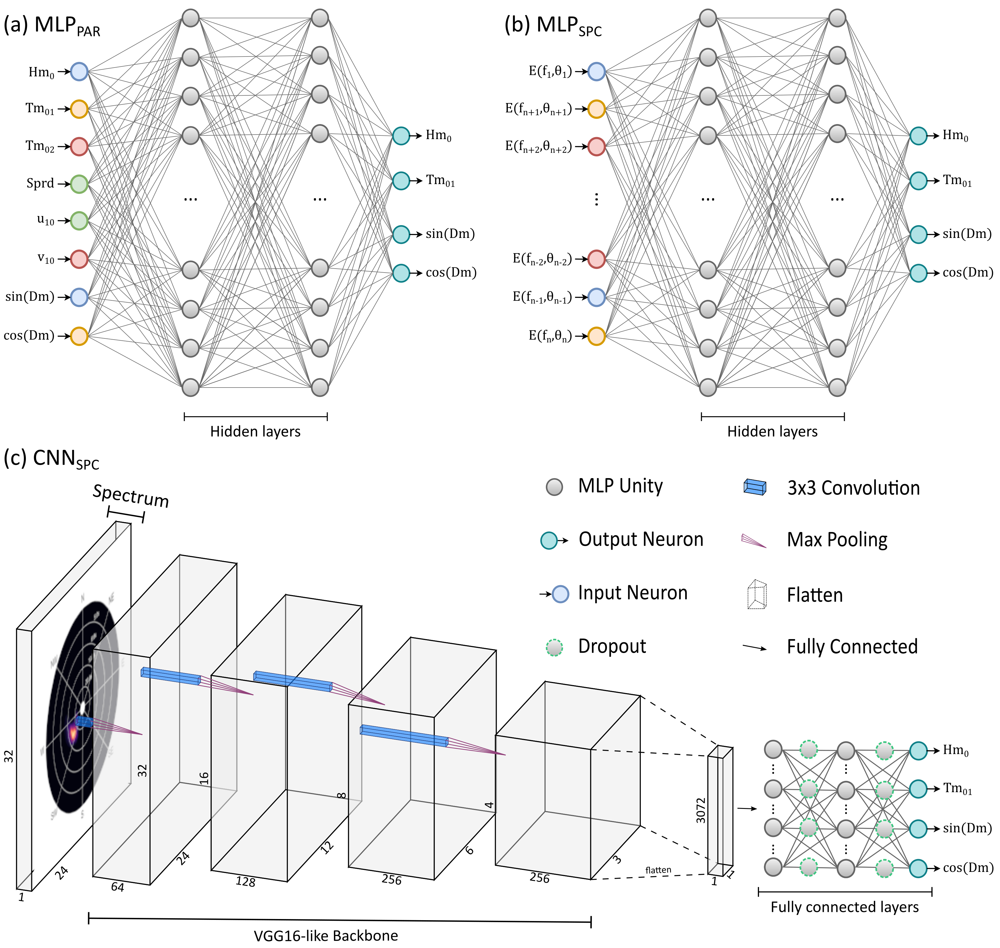
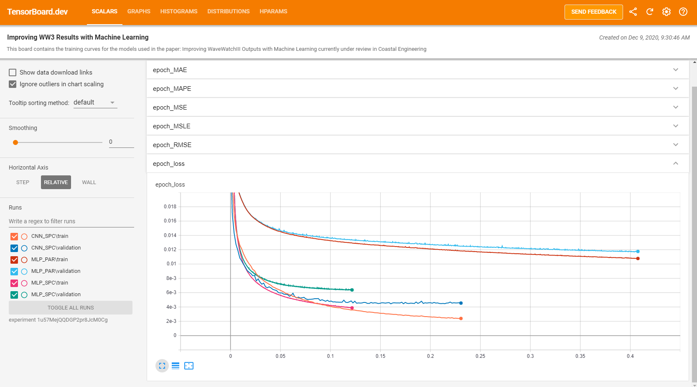

# Improving WW3 Results with Machine Learning

This repository contains the models used in the paper: *Improving WaveWatchIII Outputs with Machine Learning* currently under review in *Coastal Engineering*.

# Data

The  data is to heavy to be hosted by Github. Please use the links below to download it.

Google drive link here.


## 1. Model Architecture

Three models are architectures are available:

### a) `MLP_PAR_HTD`

Multilayer Perceptron (MLP) trained using integrated wave parameters (`Hm0`, `Tm01`, `Tm02`, `Dm`, `Spd`) and wind (`U10`, `V10`) as inputs.

### b) `MLP_SPC_HTD`

Multilayer Perceptron (MLP) trained using the flattened wave spectrum as inputs.

### c) `CNN_SPC_HTD`

Convolutional Neural Network (CNN) based on the `VGG16` architecture and using the wave spectrum in two-dimensional form.

The neural nets look something like this:




## 2. Training

[](https://colab.research.google.com/drive/1JiNAzjf1RRQDTbYDpIfpez4g8rdZNYSv?usp=sharing) **\|** [](notebooks/train.ipynb)

Training the models is done using the same script: ```train.py```. For help, do:

```bash
python train.py --help
```

<details>
  <summary> Options are (click to expand): </summary>

  - `-i, --data`: Input data (.csv).

  - `-m, --model`:  Model name.

  - `-t, --type`: Model type. Possible choices are: `cnn_spectral`, `mlp_parametric` or `mlp_spectral`.

  - `--logdir`: Logging directory for `Tensorboard`.

  - `--random-state`: Random state. Used for reproducibility.

  - `--test-size`:  Test set size. Default is 0.3.

  - `--layers`: Number of layers for MLP models. Default is 3.

  - `-neurons`: Number of neurons per layer for MLP models. Default is 256.

  - `--learning-rate`: Learning rate for ADAM. Default is 10E-6.

  - `--dropout`: Dropout rate. Default is 0.25.

  - `--epochs`: Number of training epochs. Default is 128.

  - `--batch-size`: Batch size. Default is 2048.

  - `--stratify`:  Use class stratification (by location name). Default is True.

  - `--input-size`: 2d-spectrum size for CNN models. Default is 32x24.

</details>
<br/>

To obtain the results seen in the paper do:

```bash
python train.py --type "mlp_parametric" --model "MLP_PAR_HTD" -i "data/wave_data.csv" --logdir  "logs/MLP_PAR" --epochs 2048 --layers 2 --neurons 512 --learning-rate 0.0001 --random-state 42 --test-size 0.25
```

```bash
python train.py --type "mlp_spectral" --model "MLP_SPC_HTD" -i "data/wave_data.csv" --logdir  "logs/MLP_SPC" --layers 3 --neurons 128 --epochs 1024 --learning-rate 0.0001 --random-state 42 --test-size 0.25
```

```bash
python train.py --type "cnn_spectral" --model "CNN_SPC_HTD" -i "data/wave_data.csv" --logdir "logs/CNN_SCP" --epochs 256 --batch-size 128
```

## 3. Evaluation


### 3.1. Training curves




```bash
tensorboard dev upload --logdir "logs/" --name "Improving WW3 Results with Machine Learning" --description "This board contains the training curves for the models used in the paper: Improving WaveWatchIII Outputs with Machine Learning currently under review in Coastal Engineering"
```

### 3.2. Metrics

To reproduce the results in the paper, do:

#### a) `MLP_PAR_HTD`
```bash
python metrics.py -i "data/MLP_PAR/predictions.csv" -o "data/MLP_PAR/metrics.csv"
```

**Train**

|          | RMSE  |      | MAE   |      | MAPE  |      | Bias  |       | r    |      |
|----------|-------|------|-------|------|-------|------|-------|-------|------|------|
|          | WW3   | ML   | WW3   | ML   | WW3   | ML   | WW3   | ML    | WW3  | ML   |
| Hs [m]   | 0.56  | 0.34 | 0.45  | 0.26 | 33.23 | 16.9 | -0.28 | -0.01 | 0.78 | 0.9  |
| Tp [s]   | 1.67  | 0.96 | 1.26  | 0.71 | 15.16 | 8.29 | -0.9  | 0     | 0.65 | 0.81 |
| Dm [Deg] | 17.85 | 9.19 | 13.84 | 7.05 | 5.36  | 2.84 | 10.42 | 0.32  | 0.75 | 0.91 |

**Valid**

|          | RMSE  |      | MAE   |      | MAPE  |       | Bias  |       | r    |     |
|----------|-------|------|-------|------|-------|-------|-------|-------|------|-----|
|          | WW3   | ML   | WW3   | ML   | WW3   | ML    | WW3   | ML    | WW3  | ML  |
| Hs [m]   | 0.57  | 0.34 | 0.45  | 0.26 | 32.91 | 16.39 | -0.29 | -0.01 | 0.78 | 0.9 |
| Tp [s]   | 1.68  | 0.97 | 1.27  | 0.72 | 15.21 | 8.34  | -0.91 | 0     | 0.65 | 0.8 |
| Dm [Deg] | 17.94 | 9.57 | 13.81 | 7.11 | 5.52  | 3.04  | 10.31 | 0.27  | 0.76 | 0.9 |


**Test**

|          | RMSE  |      | MAE   |      | MAPE  |       | Bias  |       | r    |      |
|----------|-------|------|-------|------|-------|-------|-------|-------|------|------|
|          | WW3   | ML   | WW3   | ML   | WW3   | ML    | WW3   | ML    | WW3  | ML   |
| Hs [m]   | 0.57  | 0.35 | 0.45  | 0.26 | 35.53 | 18.84 | -0.29 | -0.01 | 0.78 | 0.89 |
| Tp [s]   | 1.68  | 0.98 | 1.27  | 0.72 | 15.25 | 8.43  | -0.9  | 0.01  | 0.65 | 0.8  |
| Dm [Deg] | 17.89 | 9.35 | 13.84 | 7.13 | 5.36  | 2.87  | 10.35 | 0.13  | 0.75 | 0.9  |


#### b) `MLP_SPC_HTD`
```bash
python metrics.py -i "data/MLP_SPC/predictions.csv" -o "data/MLP_SPC/metrics.csv"
```

**Train**

|          | RMSE  |      | MAE   |      | MAPE  |      | Bias  |       | r    |      |
|----------|-------|------|-------|------|-------|------|-------|-------|------|------|
|          | WW3   | ML   | WW3   | ML   | WW3   | ML   | WW3   | ML    | WW3  | ML   |
| Hs [m]   | 0.57  | 0.19 | 0.45  | 0.13 | 34.28 | 8.87 | -0.29 | 0.01  | 0.78 | 0.97 |
| Tp [s]   | 1.67  | 0.5  | 1.26  | 0.37 | 15.18 | 4.32 | -0.91 | 0.03  | 0.65 | 0.95 |
| Dm [Deg] | 17.99 | 4.1  | 13.91 | 2.81 | 5.45  | 1.21 | 10.47 | -0.07 | 0.75 | 0.98 |


**Valid**

|          | RMSE  |      | MAE   |      | MAPE  |       | Bias  |       | r    |      |
|----------|-------|------|-------|------|-------|-------|-------|-------|------|------|
|          | WW3   | ML   | WW3   | ML   | WW3   | ML    | WW3   | ML    | WW3  | ML   |
| Hs [m]   | 0.56  | 0.25 | 0.45  | 0.18 | 33.3  | 11.48 | -0.28 | 0.01  | 0.78 | 0.95 |
| Tp [s]   | 1.67  | 0.76 | 1.27  | 0.54 | 15.21 | 6.19  | -0.91 | 0.02  | 0.65 | 0.89 |
| Dm [Deg] | 17.74 | 5.89 | 13.75 | 4.29 | 5.32  | 1.72  | 10.13 | -0.01 | 0.76 | 0.96 |

**Test**

|          | RMSE  |      | MAE   |      | MAPE  |       | Bias  |       | r    |      |
|----------|-------|------|-------|------|-------|-------|-------|-------|------|------|
|          | WW3   | ML   | WW3   | ML   | WW3   | ML    | WW3   | ML    | WW3  | ML   |
| Hs [m]   | 0.56  | 0.24 | 0.45  | 0.18 | 32.88 | 11.05 | -0.28 | 0.02  | 0.78 | 0.95 |
| Tp [s]   | 1.67  | 0.75 | 1.27  | 0.53 | 15.19 | 6.13  | -0.89 | 0.04  | 0.65 | 0.89 |
| Dm [Deg] | 17.72 | 5.86 | 13.73 | 4.23 | 5.32  | 1.7   | 10.36 | -0.03 | 0.76 | 0.96 |


#### c) `CNN_SPC_HTD`
```bash
python metrics.py -i "data/CNN_SPC/predictions.csv" -o "data/CNN_SPC/metrics.csv"
```

**Train**

|          | RMSE  |      | MAE   |      | MAPE |      | Bias  |       | r    |      |
|----------|-------|------|-------|------|------|------|-------|-------|------|------|
|          | WW3   | ML   | WW3   | ML   | WW3  | ML   | WW3   | ML    | WW3  | ML   |
| Hs [m]   | 0.57  | 0.14 | 0.45  | 0.1  | 33.3 | 6.3  | -0.28 | 0     | 0.78 | 0.98 |
| Tp [s]   | 1.66  | 0.41 | 1.25  | 0.3  | 15.1 | 3.51 | -0.9  | -0.04 | 0.66 | 0.97 |
| Dm [Deg] | 17.92 | 3.17 | 13.88 | 2.37 | 5.38 | 0.95 | 10.41 | -0.31 | 0.75 | 0.99 |

**Valid**

|          | RMSE  |      | MAE   |      | MAPE  |      | Bias  |       | r    |      |
|----------|-------|------|-------|------|-------|------|-------|-------|------|------|
|          | WW3   | ML   | WW3   | ML   | WW3   | ML   | WW3   | ML    | WW3  | ML   |
| Hs [m]   | 0.57  | 0.2  | 0.45  | 0.14 | 35.98 | 9.64 | -0.29 | 0     | 0.78 | 0.97 |
| Tp [s]   | 1.7   | 0.64 | 1.29  | 0.45 | 15.45 | 5.28 | -0.92 | -0.05 | 0.64 | 0.92 |
| Dm [Deg] | 17.98 | 5.36 | 13.87 | 3.55 | 5.52  | 1.59 | 10.34 | -0.34 | 0.76 | 0.97 |

**Test**

|          | RMSE  |      | MAE   |      | MAPE  |      | Bias  |       | r    |      |
|----------|-------|------|-------|------|-------|------|-------|-------|------|------|
|          | WW3   | ML   | WW3   | ML   | WW3   | ML   | WW3   | ML    | WW3  | ML   |
| Hs [m]   | 0.56  | 0.2  | 0.45  | 0.14 | 32.89 | 8.73 | -0.28 | 0     | 0.78 | 0.97 |
| Tp [s]   | 1.67  | 0.64 | 1.26  | 0.45 | 15.15 | 5.23 | -0.89 | -0.03 | 0.65 | 0.92 |
| Dm [Deg] | 17.74 | 4.76 | 13.74 | 3.5  | 5.32  | 1.41 | 10.35 | -0.29 | 0.76 | 0.98 |


### 3.3. Timeseries

```bash
python timeseries.py -i "data/MLP_PAR/predictions.csv" -ID "BCurau" -o "metrics_mlp_par.png" --start "2013-03-01 00:00:00" --duration "120"
```
